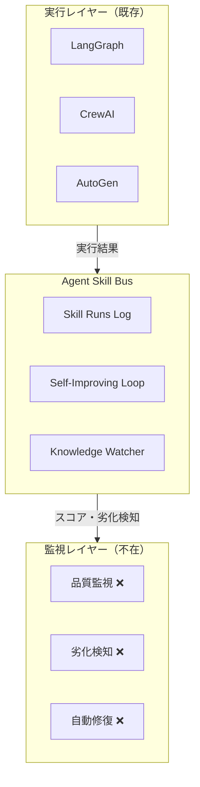
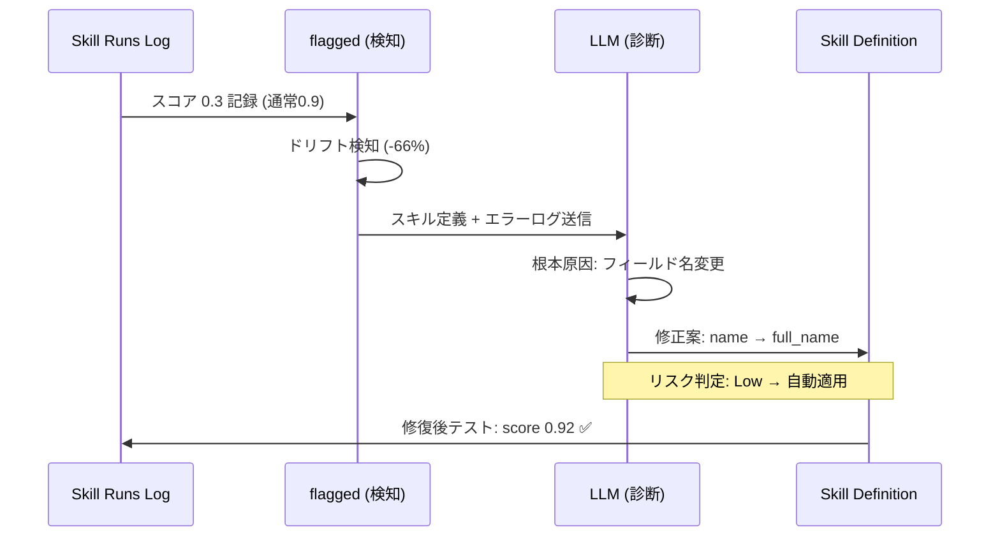

## はじめに

合同会社みやびでは、42のAIエージェントが毎日27タスクを自律的に処理しています。Claude Code用26個、OpenClaw用38個、Codex用17個——複数フレームワークを横断する合計81個のスキルが日々動いています。

この規模で運用して1年。最も痛かった問題は**「スキルが静かに壊れる」**ことでした。

```
Week 1: OAuth tokenでAPI呼び出し → 成功 (score: 0.95)
Week 3: token期限切れ → 401を "空の結果" として返す (score: 0.40)
Week 5: ユーザーから「最近データ取れてない」と報告 → そこで初めて気づく
```

エラーは出ていません。プロセスは正常に完了しています。でも**出力の品質が静かに劣化している**。これがスキル運用最大の盲点です。

この記事では、この問題に対して私たちが構築した監視・自動修復の仕組み「[Agent Skill Bus](https://github.com/ShunsukeHayashi/agent-skill-bus)」の**実践的な導入手順**と**1年間の運用データ**を共有します。

## スキルが「壊れる」4つのパターン

81個のスキルを運用して見えた、劣化の4パターンです。

### 1. API Changes（外部API変更）

一番多いパターンです。外部APIが予告なしに変わります。

```typescript
// Week 1: 正常に動作
const name = response.data.name; // "Alice"

// Week 3: APIがv3にアップデート（フィールド名変更）
const name = response.data.name; // undefined（full_nameに変わった）
```

エラーは出ません。`undefined`が後続処理に渡され、結果だけが悪化します。

### 2. Model Updates（LLMアップデート）

LLMプロバイダーがモデルを更新すると、同じプロンプトでも微妙に出力が変わります。丁寧にチューニングしたパース処理が15%の確率で壊れる——でも85%は正常なので気づきにくい。

### 3. Auth Expiry（認証切れ）

OAuthトークン期限切れ、APIキーローテーション、サービスアカウント権限変更。スキルは動き続けますが、401/403を「データなし」として処理してしまうケースが多発します。

### 4. Prompt Drift（プロンプト変質）

複数人がプロンプトを少しずつ修正→矛盾する指示が蓄積→出力品質が不安定に。コードの変更履歴は追えても、プロンプトの品質変化は数値化しないと見えません。

## 既存フレームワークの限界

ここが重要なポイントです。主要なエージェントフレームワークは**実行**はできますが、**品質の経時変化を監視する機能がありません**。



APMツールは「実行されたか」を教えてくれます。エラートラッカーは「クラッシュしたか」を教えてくれます。でも**「先週と比べて出力品質が40%下がった」**ことは誰も教えてくれません。

## 実装：5分で始めるスキル監視

### Step 1: 初期化

```bash
npx agent-skill-bus init
```

これだけで `.agent-skill-bus/` ディレクトリが作られ、JSONLベースのデータストアが準備されます。データベースもRedisも不要です。

```
.agent-skill-bus/
├── skill-runs.jsonl      # 実行履歴
├── queue.jsonl           # タスクキュー
├── knowledge-diffs.jsonl # 変更検知
└── active-locks.jsonl    # ファイルロック
```

### Step 2: スキル実行を記録する

スキルが完了するたびに、結果とスコアを記録します。

```bash
npx agent-skill-bus record-run \
  --agent claude-code \
  --skill gmail-gtd-labeler \
  --task "4アカウントGTDラベリング" \
  --result success \
  --score 0.95
```

**Claude Codeの場合**、`AGENTS.md` に1行追加するだけです：

```markdown
After completing any task, log the result:
npx agent-skill-bus record-run --agent claude --skill <name> --task "<task>" --result <success|fail|partial> --score <0.0-1.0>
```

**LangGraphの場合**、ツール関数のコールバックに組み込みます：

```python
from subprocess import run

def on_tool_complete(tool_name, result, quality_score):
    run([
        "npx", "agent-skill-bus", "record-run",
        "--agent", "langgraph",
        "--skill", tool_name,
        "--task", f"Executed {tool_name}",
        "--result", "success" if quality_score > 0.8 else "partial" if quality_score > 0.4 else "fail",
        "--score", str(quality_score)
    ])
```

### Step 3: 劣化を検知する

```bash
npx agent-skill-bus flagged
```

このコマンドは、以下の3つの条件でスキルをフラグします：

| 条件 | 閾値 | 意味 |
|------|------|------|
| **スコアドロップ** | 移動平均が0.75未満 | 全体的な品質低下 |
| **ドリフト** | 週次で15%以上低下 | 急激な劣化 |
| **連続失敗** | 3回以上 | 即座にアラート |

出力例：

```
⚠️  Flagged Skills (3):

  gmail-gtd-labeler
    Score: 0.95 → 0.42 (7d avg)
    Drift: -55.8%
    Last failure: "OAuth token expired"

  api-data-fetcher
    Score: 0.88 → 0.65 (7d avg)
    Drift: -26.1%
    Last failure: "Field 'name' not found in response"

  prompt-optimizer
    Consecutive failures: 4
    Last failure: "Model output parsing failed"
```

### Step 4: 自動修復ループ

`flagged` で劣化が検知されると、7ステップの自己改善ループが起動します（[ループの設計思想は前回記事で詳解](https://zenn.dev/adalocamp/articles/agent-skill-bus)）。

ここでは**実際に何が起きるか**を図で示します。



ポイントは**リスク判定**です。フィールド名変更のような低リスク修正は自動適用。アーキテクチャ変更のような高リスク修正は人間にルーティングされます。

```bash
# ダッシュボードで全体を確認
npx agent-skill-bus dashboard
```

## 1年間の運用データ

### Before / After

| メトリクス | Before（ASBなし） | After（ASB導入後） |
|-----------|-------------------|-------------------|
| 月間スキル障害 | ~15件 | ~6件 |
| 障害に気づくまで | 平均5日 | 平均7分 |
| 検知率 | 20%（5件中1件） | 100% |
| 自動修復率 | 0% | 62% |

**約60%の障害削減**。これが一番のインパクトでした。

### 最も多い失敗パターン Top 3

1. **Auth Expiry（38%）**: OAuthトークン期限切れが最多。Knowledge Watcherで事前検知するようにしてからほぼゼロに
2. **API Changes（28%）**: 外部APIのスキーマ変更。Knowledge WatcherのTier 2（日次チェック）でGitHub Issueパターンを監視
3. **Prompt Drift（22%）**: プロンプトの品質変化。スコアトレンドで早期検知→人間レビューにルーティング

### 最速の検知→修復

API呼び出しスキルのレスポンススキーマ変更を検知してから修復完了まで**7分**。

```
00:00 - record-run: score 0.3 (通常0.9)
00:01 - flagged: ドリフト検知 (-66%)
00:02 - Self-Improving Loop: DIAGNOSE開始
00:03 - DIAGNOSE: "response.data.name → response.data.full_name に変更"
00:04 - PROPOSE: スキル定義のフィールドマッピング修正案
00:05 - EVALUATE: Low risk (単純なフィールド名変更)
00:06 - APPLY: 自動適用
00:07 - 修復後のテスト実行: score 0.92 ✅
```

人間が介入したのは0回。ログを見て「ああ、直ってるね」と確認しただけです。

## まとめ

1年間81個のAIスキルを監視して得た実践知をまとめます。

### 3つのポイント

1. **スキルは壊れる前提で設計する**: 全スキル実行にスコアリングを組み込む。0.0-1.0の数値で品質を可視化する
2. **週次15%ドロップを閾値にする**: 急激な劣化はほぼ外部要因（API変更、認証切れ）。早く気づけば早く直せる
3. **低リスク修正は自動化、高リスクは人間へ**: フィールド名変更→自動。アーキテクチャ変更→人間レビュー

### 始め方

`npx agent-skill-bus init` → `record-run` で記録 → `flagged` で劣化チェック。上のStep 1〜4がそのまま始め方です。30秒でセットアップできます。

## 参考リンク

- **GitHub**: [github.com/ShunsukeHayashi/agent-skill-bus](https://github.com/ShunsukeHayashi/agent-skill-bus)
- **npm**: `npx agent-skill-bus init`
- **前回の記事**: [AIエージェントのスキルを自己改善させるOSSを作った](https://zenn.dev/adalocamp/articles/agent-skill-bus)
- **Skill Ecosystem (110+ skills)**: [Agent Skill Market](https://github.com/ShunsukeHayashi/agent-skill-bus#ecosystem)

---

*合同会社みやびで42のAIエージェントを本番運用しています。*
*質問やフィードバックは [X (@The_AGI_WAY)](https://x.com/The_AGI_WAY) まで。*
