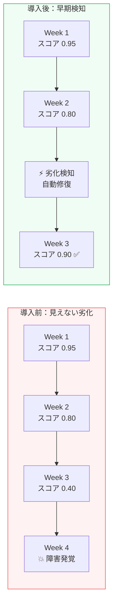
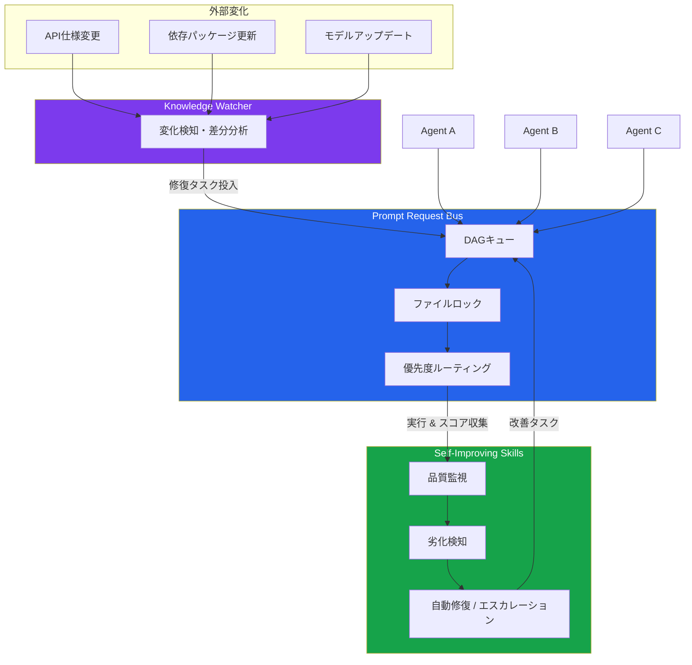
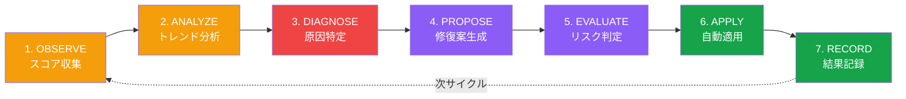
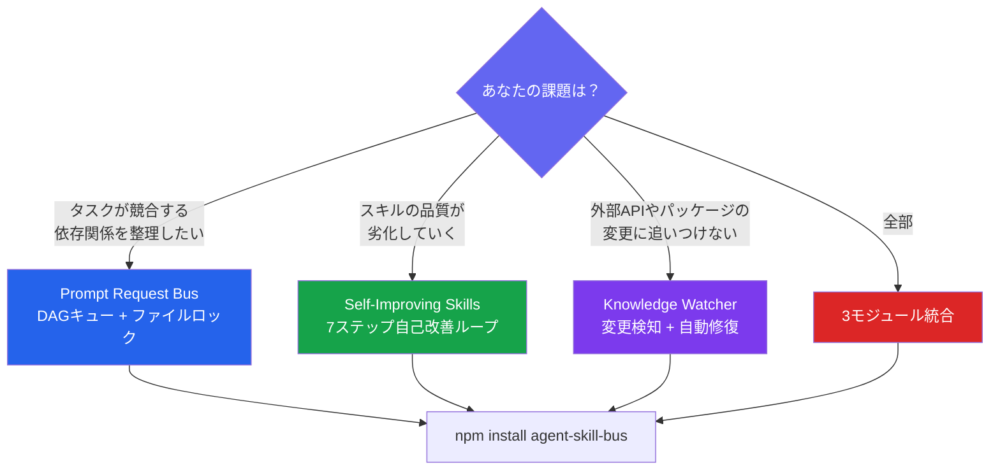

こんにちは、ハヤシシュンスケです。

42のAIエージェントを本番で動かし続けて約1年になります。Claude Code、Codex、OpenClaw、自作スクリプト——多種多様なエージェントを並走させていると、どのフレームワークも解決してくれない「運用の穴」に毎週ぶつかるようになりました。

今回はその穴を埋めるために作った OSS **agent-skill-bus** の話をします。

## エージェントが「スキルを忘れる」問題

本番で42エージェントを動かし続けて痛感したのは、**スキルは静かに劣化する**ということです。



具体的にはこういうことが起きます。

外部APIの仕様が変わる。モデルのアップデートで出力フォーマットが微妙にずれる。認証トークンが期限切れになる。エージェント自体は「動いている」ように見えるのに、品質スコアが3週間かけて0.95から0.40に下がっていく。

実際にやらかしたのは、請求書分類エージェントが2週間にわたって取引を誤分類し続けたケースです。エラーは出ない。ログも正常。でも出力がズレていた。気づいたのはダウンストリームの集計がおかしくなってからでした。

もう1つの問題が**タスクの競合**です。2つのエージェントが同じファイルを同時に編集しようとする。BullMQやRedisストリームはジョブレベルの排他はできますが、「異なるマシンで動く異種エージェントをまたいだファイルレベルのロック」は面倒です。

そして3つ目が**学習しない**問題。失敗→リトライ→また同じ失敗。失敗をスキル定義に還元するループがない。

## agent-skill-bus の3モジュール

この3つの課題を解決するために作ったのが [agent-skill-bus](https://github.com/ShunsukeHayashi/agent-skill-bus) です。



### 1. Prompt Request Bus（DAGタスクキュー）

JSONL ベースのタスクキューです。特徴はファイルレベルのロックと依存関係解決。

```typescript
import { PromptRequestBus } from 'agent-skill-bus';

const bus = new PromptRequestBus('./queue');

// 依存関係付きタスク登録
await bus.enqueue({
  id: 'analyze-report',
  prompt: 'Q1の売上レポートを分析して',
  dependsOn: ['fetch-data', 'clean-data'],  // DAG依存
  priority: 'high',
  lockFiles: ['data/q1-report.csv'],        // ファイルロック
});

// タスク取得（依存が解決済みのものだけ返ってくる）
const task = await bus.dequeue({ agentId: 'analyzer' });
```

`critical` 優先度のタスクはキューをバイパスして即時実行。TTL付きのデッドロック防止機構もあります。

### 2. Self-Improving Skills（スキル品質モニタリング）

7ステップの自己改善ループです。スコアが閾値を下回ると、自動で原因分析→修復提案→適用まで回ります。



- **OBSERVE〜ANALYZE**: スコアを時系列で集め、週次トレンドを計算
- **DIAGNOSE**: 閾値割れの根本原因を特定（API変更？モデル更新？データドリフト？）
- **PROPOSE〜EVALUATE**: 修復案を生成し、リスクレベルで自動適用か人間エスカレーションか判断
- **APPLY〜RECORD**: 低リスクなら自動適用、結果をJSONLに永続化

```typescript
import { SelfImprovingSkill } from 'agent-skill-bus';

const skill = new SelfImprovingSkill({
  name: 'invoice-classifier',
  scoreThreshold: 0.75,    // これを下回ったら検知
  driftThreshold: 0.15,    // 週次で15%以上の変動で検知
  autoApply: 'low-risk',   // リスクが低い修正は自動適用
});

// 実行後にスコアを記録するだけ
await skill.execute(task);
await skill.recordScore(0.82);

// 劣化検知時にコールバック
skill.on('drift-detected', async ({ currentScore, weeklyDelta }) => {
  console.log(`品質劣化: ${weeklyDelta * 100}%低下`);
  // 自動修復プロポーザルが生成される
});
```

これを本番に入れたら、スキルの失敗率が57%下がりました。

### 3. Knowledge Watcher（外部変更検知）

依存パッケージのバージョン変更、外部APIの仕様変更、コミュニティの新パターンを階層的に監視して、変化があったら自動的に修復タスクをキューに投入します。

```typescript
import { KnowledgeWatcher } from 'agent-skill-bus';

const watcher = new KnowledgeWatcher(bus);

await watcher.watch({
  npm: ['openai', 'anthropic', '@google-cloud/aiplatform'],
  apis: [
    { name: 'stripe-api', url: 'https://stripe.com/docs/api/changelog' },
  ],
  checkInterval: '6h',
});
// 変化検知 → 自動で修復タスクをバスに投入
```

## インストールと基本的な使い方

```bash
npm install agent-skill-bus
# または
npx agent-skill-bus init
```

3モジュールは独立しているのでそれぞれ単体でも使えます。

```typescript
// 最小構成: タスクキューだけ使う
import { PromptRequestBus } from 'agent-skill-bus';

const bus = new PromptRequestBus('./my-queue');
await bus.enqueue({ id: 'task-1', prompt: 'こんにちは' });
const task = await bus.dequeue({ agentId: 'my-agent' });
```

## どのモジュールから始めるか

3モジュールは独立しているので、自分の課題に合わせて1つだけ導入できます。



## 3日で35スター、83%がXのエンジニア経由

公開から3日で35スターをいただきました。流入元を見ると83%がX（旧Twitter）経由で、エンジニアのリツイートが連鎖した形でした。

「マルチエージェントの運用課題を整理してくれた」「ファイルレベルのロックは盲点だった」というコメントが多く、「あ、同じ課題で詰まってた人が他にもいるんだ」と実感しました。

## 技術的なこだわり：依存ゼロ

設計上の制約として**npmの依存をゼロにする**ことを決めていました。

LangChain、BullMQ、Redis——どれも優れたツールですが、「どんなエージェントでも統合できるバス」を作るには、特定のランタイムやインフラに縛られてはいけない。ファイルシステムとNode.js組み込みモジュールだけで動くことで、シェルスクリプトで動くエージェントでも、Python製エージェントでも、理屈上は接続できます。

フレームワーク非依存というのも意識しました。LangGraph、CrewAI、AutoGen——実行グラフの構築は各フレームワークが得意とするところで、そこは任せる。agent-skill-bus はその「下のレイヤー」、つまり運用インフラ層を担う位置づけです。

## 今後やること

- **awesome-list 提出中**: awesome-langchain、awesome-agents への提出を進めています
- **比較ページ**: LangGraph/CrewAI/AutoGen との比較ドキュメントを整備中
- **TypeScript 型定義の強化**: 現在の型定義は最小限なので、より厳密な型を追加予定

マルチエージェントを本番運用している方、スキルの劣化や競合で困っている方にとって少しでも参考になれば幸いです。

Issue や PR もお待ちしています。

## リンク集

| リソース | URL |
|---------|-----|
| **GitHub** | [ShunsukeHayashi/agent-skill-bus](https://github.com/ShunsukeHayashi/agent-skill-bus) |
| **npm** | [agent-skill-bus](https://www.npmjs.com/package/agent-skill-bus) |
| **Examples** | [examples/](https://github.com/ShunsukeHayashi/agent-skill-bus/tree/master/examples) |
| **TypeScript型定義** | [types/index.d.ts](https://github.com/ShunsukeHayashi/agent-skill-bus/blob/master/types/index.d.ts) |
| **他フレームワークとの比較** | [docs/comparison.md](https://github.com/ShunsukeHayashi/agent-skill-bus/blob/master/docs/comparison.md) |
| **Contributing** | [CONTRIBUTING.md](https://github.com/ShunsukeHayashi/agent-skill-bus/blob/master/CONTRIBUTING.md) |
| **ライセンス** | MIT |

### 関連リソース

- [LangGraph](https://github.com/langchain-ai/langgraph) — LangChainベースのエージェントグラフ構築
- [CrewAI](https://github.com/crewAIInc/crewAI) — ロールベースのマルチエージェントフレームワーク
- [AutoGen](https://github.com/microsoft/autogen) — Microsoftのマルチエージェント会話フレームワーク
- [VoltAgent](https://github.com/VoltAgent/voltagent) — TypeScriptエージェントフレームワーク
- [awesome-agent-skills](https://github.com/VoltAgent/awesome-agent-skills) — エージェントスキルのキュレーションリスト
