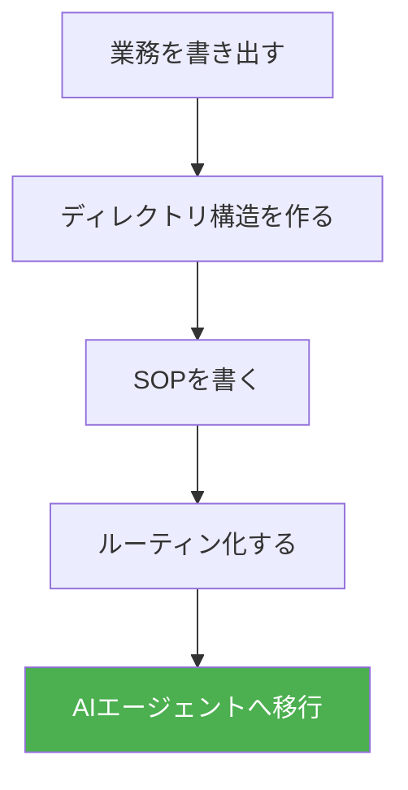

## この記事は誰のためか

42のAIエージェントを本番運用している合同会社みやびCEOが、「AIを入れる前に必要な業務構造化」の実践テンプレートをすべて公開します。

「AIエージェントに業務を任せたい」と思っているけど、**何から始めればいいか分からない人**のための記事です。

結論を先に言います。

> AIエージェントを動かす前に、「リモートで会社を作る」つもりで業務を構造化してください。

構造がないところにAIを置いても、**曖昧なことを高速処理するだけ**です。よくある失敗パターンは「ChatGPTに業務を丸投げ → 出力がバラバラ → 結局人間が手直し」。これは構造の不在が原因です。

この記事では、**すぐにコピーして使えるテンプレートを6つ**全部公開します。テンプレートをそのまま自分のフォルダに置いて、項目を埋めるだけで始められます。

:::message
**前提記事**: [AIに任せる前に「リモートで会社を作る」思考法](https://note.ambitiousai.co.jp/n/ndd5b70295a95) で「なぜ構造化が必要か」を解説しています。本記事はその**実践テンプレート編**です。
:::

### この記事のペルソナ

「医療機器開発」「ライティング副業」「業務自動化」の3つを掛け持ちしている個人事業主を想定しています。でも、業種が違っても構造化のやり方は同じです。

## なぜ「リモート会社」なのか

AIエージェントへの指示は、**会ったことがないリモートワーカーへの指示**と同じです。

| 対面チーム | リモートチーム | AIエージェント |
|-----------|-------------|--------------|
| 口頭で補足できる | 文書がすべて | 文書がすべて |
| 察してくれる | 察してくれない | **絶対に察してくれない** |
| 曖昧でも動く | 曖昧だと止まる | **曖昧だと暴走する** |

つまり、**人間のリモートワーカーに依頼できるレベル**で業務を文書化すれば、AIエージェントも動きます。逆に言えば、人に説明できない業務はAIにも任せられません。

以下が、業務構造化からAIエージェント導入までの全体フローです。



この流れに沿って、各ステップで使えるテンプレートを順番に紹介します。

## テンプレート1: ビジネス全体のディレクトリ構造

まず、あなたのビジネス全体を「フォルダ」で表現します。

```
my-business/
├── 00-vision/                    # ビジョン・ミッション
│   ├── MISSION.md                # なぜこの事業をやるのか
│   ├── GOALS.md                  # 今期の目標（数値付き）
│   └── VALUES.md                 # 判断基準・価値観
│
├── 01-projects/                  # プロジェクト別
│   ├── project-a/                # 例: 医療機器開発
│   │   ├── README.md             # プロジェクト概要
│   │   ├── requirements/         # 要件
│   │   ├── tasks/                # タスク一覧
│   │   ├── deliverables/         # 成果物
│   │   └── archive/              # 完了済み
│   ├── project-b/                # 例: ライティング業務
│   └── project-c/                # 例: 業務自動化
│
├── 02-operations/                # 日常業務
│   ├── sops/                     # 標準作業手順書
│   │   ├── daily-routine.md      # 毎日やること
│   │   ├── weekly-review.md      # 週次レビュー
│   │   └── client-onboarding.md  # クライアント対応
│   ├── templates/                # テンプレート集
│   │   ├── email-reply.md        # メール返信テンプレ
│   │   ├── invoice.md            # 請求書テンプレ
│   │   └── report.md             # レポートテンプレ
│   └── checklists/               # チェックリスト
│
├── 03-knowledge/                 # ナレッジベース
│   ├── tools/                    # 使っているツール一覧
│   ├── contacts/                 # 連絡先・取引先
│   ├── credentials/              # 認証情報（※暗号化必須）
│   └── learned/                  # 学んだこと・失敗録
│
├── 04-finance/                   # 経理・財務
│   ├── invoices/                 # 請求書
│   ├── receipts/                 # 領収書
│   └── reports/                  # 月次レポート
│
└── README.md                     # ビジネス全体の案内図
```

### ポイント

- **番号付きフォルダ**: 開いた瞬間に全体像がわかる
- **README.md**: 各フォルダに「このフォルダは何か」を1行で書く
- **フォルダ名 = 業務名**: フォルダを見ただけで業務がわかる状態にする

> **「手順書ここだよ」って指示がなくても、ディレクトリを開けば分かる状態にしておけ。**

## テンプレート2: プロジェクト定義書（README.md）

各プロジェクトの `README.md` に書くべき内容です。

```markdown
# プロジェクト名

## 概要
このプロジェクトは何か。1-2文で。

## ゴール
- [ ] 具体的な目標1（数値・期限付き）
- [ ] 具体的な目標2（数値・期限付き）

## 担当
| 役割 | 担当 | 連絡方法 |
|------|------|---------|
| オーナー | 自分 | - |
| 実作業 | （人 or AIエージェント） | Slack / メール |

## 現在のステータス
🟡 進行中 / 🟢 順調 / 🔴 ブロック中

## 必要なリソース
- ツール: 〇〇
- アカウント: 〇〇
- 予算: 〇〇円/月

## タスク
1. [ ] タスクA → 手順書: `../sops/task-a.md`
2. [ ] タスクB → 手順書: `../sops/task-b.md`

## 完了条件
このプロジェクトは、以下を達成したら「完了」とする:
- 条件1
- 条件2
```

## テンプレート3: SOP（標準作業手順書）

SOPは「あなたに会ったことがない人が、これだけ読めば同じ作業ができる」レベルで書きます。

```markdown
# SOP: [作業名]

## 目的
この作業は何のためにやるのか。

## 頻度
毎日 / 毎週月曜 / 月1回 / 依頼時

## 所要時間
約30分

## 前提条件
- [ ] ツールXにログイン済み
- [ ] データYが手元にある

## 手順

### Step 1: [やること]
1. [具体的な操作]を開く
2. [具体的なボタン]をクリック
3. [具体的な値]を入力

> 注意: [よくある間違い] をしないこと

### Step 2: [やること]
1. ...
2. ...

### Step 3: 確認
- [ ] [チェック項目1]
- [ ] [チェック項目2]

## 完了条件
- [何がどうなっていれば完了か]

## トラブルシューティング
| 症状 | 原因 | 対処 |
|------|------|------|
| エラーXが出る | 認証切れ | 再ログイン |
| 結果が空になる | フィルター設定ミス | Step 2を確認 |

## 更新履歴
- 2026-03-22: 初版作成
```

### SOP作成の3原則

1. **「What」と「How」だけ書く**: 「なぜ」は最小限。実行者は理由より手順が必要
2. **スクリーンショットを入れる**: 文字だけで伝わらない操作は画像で補う
3. **失敗パターンを書く**: 正常系だけでなく「よくある失敗」とその対処を必ず入れる

## テンプレート4: ルーティン設計書

「毎日/毎週やること」を時間軸で整理します。

```markdown
# デイリールーティン

## 朝（9:00-9:30）
1. [ ] メール確認 → 手順: `sops/email-check.md`
2. [ ] タスク一覧確認 → 手順: `sops/task-review.md`
3. [ ] 今日の優先順位決定

## 午前（9:30-12:00）
- 集中作業タイム（メイン業務）

## 午後（13:00-17:00）
- クライアント対応
- ミーティング

## 夕方（17:00-17:30）
1. [ ] 今日の進捗記録
2. [ ] 明日のタスク準備
3. [ ] 日報作成 → テンプレ: `templates/daily-report.md`

---

# ウィークリールーティン

## 月曜
- [ ] 週次目標設定
- [ ] 先週の振り返り

## 金曜
- [ ] 週次レビュー → 手順: `sops/weekly-review.md`
- [ ] 来週の準備

## 月末
- [ ] 請求書発行 → 手順: `sops/invoicing.md`
- [ ] 月次レポート作成
```

## テンプレート5: AIエージェントへの移行マップ

ここまでの構造ができたら、初めてAIエージェントを考えます。

```
人間の業務フロー          →  AIエージェントへの移行
─────────────────────────────────────────────────
README.md（プロジェクト定義）  →  エージェントのコンテキスト（背景知識）
SOP（手順書）                 →  エージェントのスキル定義（実行手順）
ルーティン                    →  cronジョブ（定時自動実行の仕組み）
テンプレート                  →  出力フォーマット指定
チェックリスト                →  品質ゲート（自動検証）
ナレッジベース                →  RAG（AIに外部知識を参照させる技術）
```

### 移行の優先順位

| 優先度 | 業務の特徴 | 例 |
|--------|-----------|-----|
| 🟢 すぐ移行 | 手順が明確・繰り返し・判断不要 | メール分類、データ入力、定型レポート |
| 🟡 段階的に | 手順はあるが判断が必要 | 記事の下書き、コードレビュー |
| 🔴 最後に | 創造性・人間関係が必要 | 戦略立案、クライアント交渉 |

### 実装例: SOPからエージェントスキルへ

SOPで書いた手順書が、そのままAIエージェントの「スキル」になります。

**人間向けSOP:**
```markdown
# メール確認手順
1. Gmailを開く
2. 未読メールを確認
3. 「要返信」「要確認」「不要」に分類
4. 「要返信」にはドラフトを作成
```

**AIエージェント向けスキル定義:**
```markdown
# スキル: email-triage
## トリガー: 毎朝9:00
## 手順:
1. Gmail API（Googleのメール操作インターフェース）で未読メールを取得
2. 各メールを「要返信」「要確認」「不要」に分類
3. 「要返信」にはドラフトを自動作成
4. 結果をSlackに通知
## 完了条件: 全未読メールが分類済み
```

**違いは「ツール名が具体的になっただけ」です。** 人に説明できる手順書があれば、AIへの移行は翻訳作業に過ぎません。

### よくある失敗: SOPなしでAIに任せると何が起きるか

SOPを書かずにAIエージェントに「メール処理して」と指示すると:

- 重要なクライアントメールを「不要」に分類する
- 全メールに返信ドラフトを作ってしまう
- 分類基準が毎回変わる

SOPがあれば「ステップ3の判断基準に従って分類」と指定できます。**構造がないから失敗する**のであって、AIの性能の問題ではありません。

## テンプレート6: README.md（ビジネス全体の案内図）

最後に、ルートの `README.md` テンプレートです。これが「入社初日のオリエンテーション資料」になります。

```markdown
# [あなたのビジネス名]

## このリポジトリ（フォルダ）について
[1文で説明]

## クイックスタート
1. `00-vision/MISSION.md` を読む
2. `01-projects/` で進行中プロジェクトを確認
3. `02-operations/sops/daily-routine.md` でデイリールーティンを確認

## ディレクトリガイド
| フォルダ | 内容 | 更新頻度 |
|---------|------|---------|
| 00-vision | ビジョン・目標 | 四半期 |
| 01-projects | プロジェクト別管理 | 毎日 |
| 02-operations | 日常業務・SOP | 月次 |
| 03-knowledge | ナレッジベース | 随時 |
| 04-finance | 経理・財務 | 月次 |

## 連絡先
- オーナー: [名前]
- 問い合わせ: [メール/Slack]

## 更新ルール
- SOP変更時は日付を入れる
- 新プロジェクト追加時はこのREADMEも更新する
```

## 実践: 3つの事業を構造化する例

冒頭のペルソナ——「医療機器開発」「ライティング副業」「業務自動化」を掛け持つ個人事業主——の場合、実際に構造化するとこうなります。

```
my-business/
├── 00-vision/
│   ├── MISSION.md        # 「技術×医療で社会に貢献する」
│   └── GOALS.md          # Q2目標: 機器プロトタイプ完成
│
├── 01-projects/
│   ├── medical-device/           # 医療機器開発
│   │   ├── README.md             # プロジェクト定義
│   │   ├── requirements/         # 薬事法要件、仕様書
│   │   ├── research/             # 調査結果
│   │   └── prototypes/           # 試作データ
│   │
│   ├── writing-service/          # ライティング業務
│   │   ├── README.md             # 受注管理
│   │   ├── clients/              # クライアント別
│   │   ├── templates/            # 記事テンプレ
│   │   └── portfolio/            # 実績
│   │
│   └── automation/               # 業務自動化
│       ├── README.md             # 自動化対象一覧
│       ├── email/                # メール自動化
│       ├── reporting/            # レポート自動化
│       └── scheduling/           # スケジュール自動化
│
├── 02-operations/
│   ├── sops/
│   │   ├── daily-routine.md      # 毎日のルーティン
│   │   ├── article-writing.md    # 記事執筆手順
│   │   ├── client-meeting.md     # クライアント対応
│   │   └── invoicing.md          # 請求手順
│   └── templates/
│       ├── article-draft.md      # 記事テンプレ
│       └── meeting-notes.md      # 議事録テンプレ
│
└── 03-knowledge/
    ├── tools.md                  # ツール一覧
    ├── medical-regulations/      # 医療機器関連法規
    └── writing-guidelines/       # ライティング基準
```

**このフォルダ構造を作るだけで、頭の中が整理されます。** そして、この構造がそのまま「AIエージェントのワークスペース」になります。

## まとめ: 3ステップで始める

### 1. フォルダを作る（今日）
上のテンプレートをコピーして、自分のビジネスに当てはめる。完璧じゃなくていい。

### 2. SOPを1つ書く（今週）
一番よくやる作業の手順書を1つだけ書く。「会ったことない人に渡せるレベル」が基準。

### 3. ルーティンを書く（来週）
毎日・毎週やることをリスト化する。これがAIの「定期実行タスク」の元になる。

> **構造が先、AIは後。** この順番を守れば、どんなAIエージェントでも機能します。

## 補足: 構造化していないと起きること

私がメンタリングしていて一番多い相談が「AIに何を任せればいいか分からない」です。

でも話を聞くと、そもそも**自分が何をやっているかが構造化されていない**。頭の中にはあるけど、文書になっていない。だから人にも説明できないし、AIにも説明できない。

構造化していないビジネスでAIを導入しようとすると:

1. **何を任せるか決められない** → 結局手作業のまま
2. **任せても品質がバラバラ** → 基準が文書化されていないから
3. **AIの出力を評価できない** → 「正解」が定義されていないから

逆に構造化さえできていれば、AIの技術は何でもいい。ChatGPTでも、Claude Codeでも、自作のスクリプトでも。**構造はAIの種類に依存しない**から、一度作れば長く使えます。

## 参考リンク

- **なぜ構造化が必要か**: [AIに任せる前に「リモートで会社を作る」思考法](https://note.ambitiousai.co.jp/n/ndd5b70295a95)
- **AIスキルの品質監視**: [81個のAIエージェントスキルを本番監視・自動修復する実践ガイド](https://zenn.dev/adalocamp/articles/agent-skill-bus-production-monitoring)
- **Agent Skill Bus**: [AIエージェントのスキルを自己改善させるOSSを作った](https://zenn.dev/adalocamp/articles/agent-skill-bus)

---

*合同会社みやびで42のAIエージェントを本番運用しています。*
*質問やフィードバックは [X (@The_AGI_WAY)](https://x.com/The_AGI_WAY) まで。*
